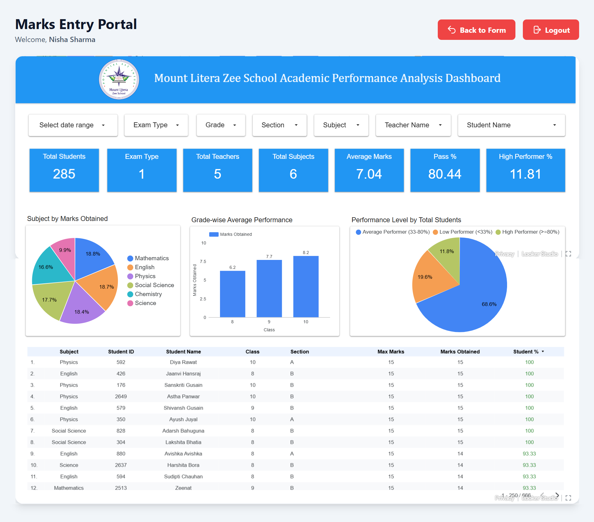

# 🎓 EduTrack — Marks Management & Academic Performance Analytics Portal

EduTrack is a complete marks management and analytics system designed for schools. It streamlines marks entry, minimizes human errors, and provides instant performance insights through real-time dashboards. Teachers get secure login access, automated forms, and a smooth submission experience, while school admins get powerful analytical reports.

---

## 📊 Overview

EduTrack enables teachers to:

- Log in securely  
- Enter marks with automated validation  
- Auto-fill max marks based on exam type  
- Mark students present/absent  
- Submit error-free data  
- View real-time academic analytics  

### **Key Highlights**
- 🔐 Secure authentication via Google Apps Script  
- 🏫 Auto-linked teacher access (class & section based on ID)  
- 📝 Smart marks entry with real-time validation  
- 🚫 Absent toggle with auto-handled marks  
- ⚡ Loading animation + success popup  
- 📊 Live Looker Studio dashboards synced with Google Sheets  
- ⏳ 90% reduction in reporting time  

---

## 🚀 Live Demo

**Teacher Login Portal:**  
https://rachit.short.gy/edutrack

**GitHub Repository:**  
https://github.com/rachitagrawal03/EduTrack

---

## 🖥️ Platform Screenshots

### 🔐 Login Page  

### 🧾 Marks Entry Form — Empty State  

### 🧾 Marks Entry Form — After Selecting Class/Section  

### 🧾 Marks Entry Form — Student List Loaded  

### ✏️ Filled Marks Form — Ready for Submission  

### ⏳ Submission Loader  

### ✅ Successful Marks Submission  

### 📊 Academic Performance Dashboard  

---

## 🎯 Core Modules

### **1. Authentication & Access Control**
- Secure teacher login  
- Maps teachers to assigned classes/sections  
- Prevents unauthorized access  

### **2. Smart Marks Entry System**
- Auto-filled max marks  
- Real-time validation  
- Present/Absent toggle  
- Inline warnings  
- Smooth UI & confetti success animation  

### **3. Backend Data Processing**
- Google Sheets as structured database  
- Stores timestamped, clean data  
- Prevents duplicate entries  
- Automatically updates dashboard source data  

### **4. Real-Time Analytics Dashboard**
Includes metrics like:
- Total students, teachers, subjects  
- Average marks, pass %, high performer %  
- Subject-wise marks distribution  
- Grade-wise performance trends  
- Student-level results table  

---

## 🛠️ Tech Stack

**Frontend:**  
React.js (Vite), TypeScript, HTML, CSS

**Backend:**  
Google Apps Script, Web APIs

**Database:**  
Google Sheets

**Analytics:**  
Looker Studio

---

## 📁 Project Structure

EduTrack/
├── components/                 # UI components (inputs, loaders, modals)
├── hooks/                      # Custom React hooks for logic reuse
├── images/                     # Project screenshots used in README
├── services/                   # Apps Script and API service handlers
│
├── App.tsx                     # Root React application
├── index.tsx                   # Entry point for React
├── index.html                  # Base HTML template for Vite
│
├── Code.gs                     # Main Google Apps Script backend (auth, submission)
├── code.gs                     # Additional Apps Script utility logic
│
├── metadata.json               # Metadata for form configuration and exam settings
├── types.ts                    # TypeScript interfaces and data models
│
├── package.json                # Dependencies and project scripts
├── tsconfig.json               # TypeScript configuration
├── vite.config.ts              # Vite bundler configuration
│
└── README.md                   # Project documentation

---

## 📈 Impact

- ⏳ 70% teacher workload reduction  
- 🧮 100% error-free submissions  
- 📊 90% faster academic reporting  
- ⚡ Real-time insights for school admins  

---

## 🔧 How to Use

### **For Teachers**
1. Log in  
2. Select Exam → Class → Section → Subject  
3. Enter marks / toggle Absent  
4. Submit  
5. View success confirmation  

### **For Admins**
1. Open Google Sheet submissions  
2. Access Looker Studio Dashboard  
3. Filter by class, exam, teacher, subject  
4. Export reports if needed  

